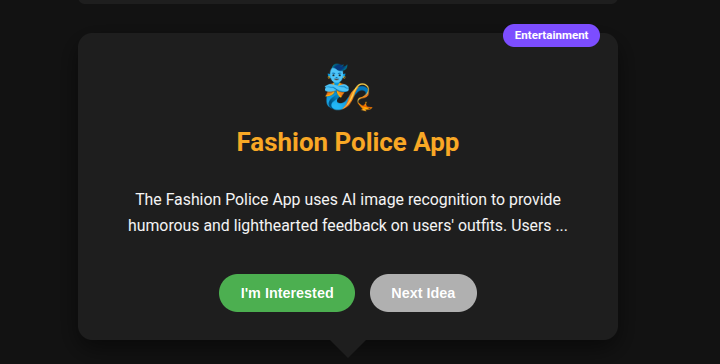

# The Dollar Software Genie
 
Generate creative software ideas that cost approximately $1 in API fees to implement using AI code generation tools.

## Features

- Generate random software ideas with a slot machine interface
- Filter ideas by category
- View detailed idea descriptions and features
- Generate complete code implementations
- Copy code to clipboard
- No backend required - runs entirely in the browser

## How It Works

1. Spin the slot machine to generate a random software idea
2. View the idea details and decide if you're interested
3. Generate code for the idea using OpenAI's API
4. Copy the code and implement it yourself

## API Key

You'll need to provide your own OpenAI API key to generate ideas and code. The key is stored locally in your browser and never sent to our servers.

Check out the configuration reference at https://huggingface.co/docs/hub/spaces-config-reference

## Screenshots

  

    
    
    
    
    
    
    
    
    
  

 